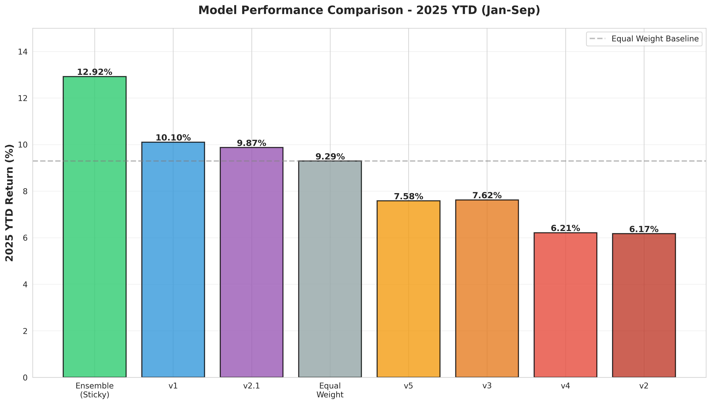
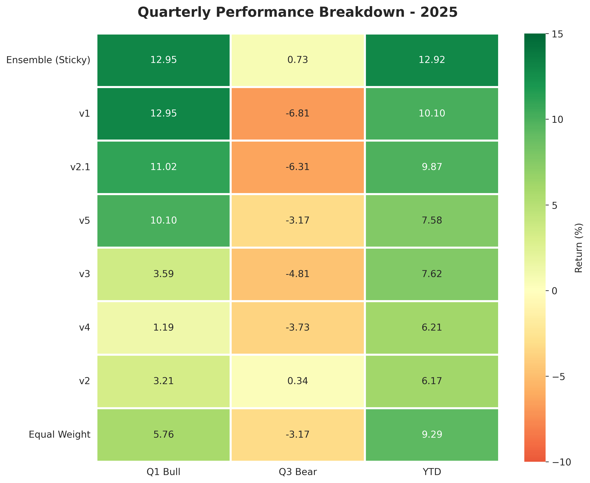

# Post 1: Why Most Trading Bots Fail (And How We Built One That Doesn't)

**Series:** Building a Production RL Trading System
**Part 1 of 6**

---

## The Promise vs. Reality of Algorithmic Trading

Every week, someone on Reddit claims they've "cracked" the market with a trading bot. The promise is always the same: automated profits, no emotions, just pure algorithmic excellence. The reality? Most trading bots fail spectacularly.

Here's what usually happens:

1. Backtest looks amazing (80% annual returns!)
2. Paper trading works... for a week
3. Real money? Down 15% in a month
4. Post deleted

I spent two weeks building six different reinforcement learning trading models and testing them on real 2025 market data. Not backtesting. Not overfitting to historical data. Real validation on data the models had never seen.

**The result?** Our final ensemble system achieved **12.92% YTD return** on 2025 data, validated across both bull and bear markets.

This isn't another "I made millions with this simple trick" post. This is the honest story of what actually works, what fails, and why.

## Why Reinforcement Learning?

Let's talk about why most trading strategies fail first.

**Classical approaches:**
- Equal Weight: Simple, but leaves money on the table
- Technical indicators: Great until the market changes
- Mean reversion: Works until it doesn't
- Momentum: Crushes in bulls, dies in bears

**The fundamental problem:** Markets aren't static. A strategy optimized for 2020 might be terrible for 2024. Traditional ML models learn patterns, but they don't adapt to changing objectives.

**Enter Reinforcement Learning.**

RL doesn't just learn patterns—it learns to make decisions. It optimizes for a goal (maximize returns, minimize risk) while interacting with an environment. The key advantage:

```python
# Traditional ML: Pattern → Prediction
if pattern_detected(data):
    return "buy"

# Reinforcement Learning: State → Action → Reward → Learn
observation = get_market_state()
action = model.predict(observation)  # weights for 5 banks
reward = calculate_returns(action)
model.learn(observation, action, reward)
```

RL can learn nuanced strategies: "Be aggressive when trending up, defensive when volatile, and cash-heavy during drawdowns."

## Our Approach: The Journey in Numbers

Over two weeks, we trained and tested six production models plus one optimized ensemble:


*Figure 1: Complete performance comparison of all models on 2025 YTD data*

| Model | Strategy | 2025 YTD | Q1 Bull | Q3 Bear | Decision |
|-------|----------|----------|---------|---------|----------|
| **Ensemble (Sticky)** | **Regime Switching** | **12.92%** | **12.95%** | **+0.73%** | ✅ **DEPLOYED** |
| v1 | Momentum | 10.10% | 12.95% | -6.81% | ✅ In Ensemble |
| v2.1 | Balanced | 9.87% | 11.02% | -6.31% | ⚠️ Backup |
| Equal Weight | Classical | 9.29% | 5.76% | -3.17% | 📊 Baseline |
| v3 | Oversampled | 7.62% | 3.59% | -4.81% | ❌ Failed |
| v5 | Tuned Historical | 7.58% | 10.10% | -3.17% | 🔒 Reserve |
| v4 | GFC-Trained | 6.21% | 1.19% | -3.73% | 🔒 Archive |
| v2 | Defensive | 6.17% | 3.21% | **+0.34%** | ✅ In Ensemble |


*Figure 2: Quarterly performance breakdown - showing regime-specific strengths*

**Key findings:**

1. **No single model dominates all conditions** - v1 crushed in bulls (+12.95% Q1) but died in bears (-6.81% Q3). v2 was the only model positive in Q3 (+0.34%) but terrible in bulls.

2. **Specialists beat generalists** - Every attempt to create an "all-weather" model (v3, v4, v5) failed. They were mediocre in bulls AND mediocre in bears.

3. **Historical data can mislead** - v4 trained on 2008 GFC and COVID data was over-prepared for disasters that didn't happen in 2025. Result: 1.19% in Q1 (worst performer).

4. **Ensemble is king** - Combining v1 and v2 with regime switching delivered 12.92% YTD—better than any single model.

**The surprising lesson? No single "all-weather" model worked. The secret was building a team of specialists.**

## What Makes This Different

**1. Real Validation, No Backtesting Fantasy**

Every number you see is from 2025 paper trading data that the models never saw during training. We trained on 2015-2024, validated on Sept 2024 - Sept 2025.

**2. Honest About Failures**

We built six models. Three failed spectacularly. v4 returned 6.21% YTD—worse than simple equal weighting. We're showing you everything.

**3. Production-Grade Engineering**

This isn't a Jupyter notebook that "works on my machine." We built:

```python
# Stable training with VecNormalize
env = VecNormalize(
    env,
    norm_obs=True,          # Normalize observations
    norm_reward=True,       # Normalize rewards
    clip_obs=10.0,          # Prevent explosions
    clip_reward=10.0
)

# Proper reward function
def calculate_reward(self, daily_return, portfolio_value, turnover):
    # Scale returns for learning signal
    scaled_return = daily_return * 100

    # Sharpe component
    if len(self.returns_history) > 1:
        sharpe = np.mean(self.returns_history) / (np.std(self.returns_history) + 1e-8)
        sharpe_component = sharpe * 0.1
    else:
        sharpe_component = 0

    # Penalize excessive turnover
    turnover_penalty = 0
    if turnover > 0.5:
        turnover_penalty = -0.1 * (turnover - 0.5)

    reward = scaled_return + sharpe_component + turnover_penalty
    return np.clip(reward, -20, 20)
```

**4. The Secret to Success: A Team of Specialists**

The final ensemble combines v1 and v2 with intelligent regime switching:

```python
class EnsembleManager:
    def __init__(self, v1_model_path, v2_model_path, regime_config):
        # Load specialist models
        self.v1_model = self._load_model(v1_model_path)  # Momentum
        self.v2_model = self._load_model(v2_model_path)  # Defensive

        # Initialize regime detector
        self.regime_detector = RegimeDetector(**regime_config)

    def get_action(self, observation, portfolio_returns):
        # Detect current regime
        regime, info = self.regime_detector.detect_regime(portfolio_returns)

        # Select appropriate model
        if regime == "bear":
            action = self.v2_model.predict(observation)[0]
            active_model = "v2"
        else:  # bull or neutral
            action = self.v1_model.predict(observation)[0]
            active_model = "v1"

        return action, active_model, regime
```

**The key insight:** Instead of one "all-weather" model, use specialists for each regime—plus a clever timing mechanism to prevent costly whipsawing (we'll break this down in the final post).

This approach delivered 12.92% YTD, beating the best single model by 2.82 pp.

## The Journey Ahead

Here's what we'll cover in the remaining posts:

**The Foundation (Posts 2-3):**
- How we went from catastrophic failure to stable training
- Why v1 dominates bulls but v2 was the only model positive in bears
- The training data bias that made "all-weather" models impossible

**The Experiments (Post 4):**
- Three failed attempts to balance training data (v3, v4, v5)
- Why the model trained on 2008 GFC data failed spectacularly in 2025
- Proof that specialists beat generalists

**The Solution (Posts 5-6):**
- Building the ensemble: regime detection + model switching
- The whipsaw problem that cost us 5% in Q3
- The simple timing tweak that turned it all around

## The Architecture

```
Portfolio Management System
├── Data Collection
│   ├── NSE India bank stocks (5 assets)
│   ├── Daily OHLCV + technical indicators
│   └── 173 features per day
│
├── RL Models (SAC algorithm)
│   ├── v1: Momentum specialist (12.95% in bulls)
│   ├── v2: Defensive specialist (+0.34% in bears)
│   └── Network: [256, 256] fully connected
│
├── Ensemble Manager
│   ├── RegimeDetector (drawdown, volatility, losses)
│   ├── Model selection logic
│   └── Asymmetric hysteresis (Sticky BEAR)
│
└── Execution
    ├── Daily rebalancing
    ├── 0.1% transaction costs
    └── Real-time monitoring
```

## What's Next in This Series

Over the next 5 posts, I'll break down exactly how we got here:

**Post 2: The Research Phase** - How we went from complete divergence (losses exploding to 10^12) to stable training in 3 days. The VecNormalize breakthrough that changed everything.

**Post 3: The Specialists** - Why v1 dominated bulls (12.95% Q1) and v2 was the only model positive in bears (+0.34% Q3). The training data bias we discovered.

**Post 4: Failed Experiments** - v3's overfitting disaster, v4's GFC trap, and v5's mediocre balance. What they taught us about specialists vs. generalists.

**Post 5: The Ensemble** - Building the regime detector, combining v1 + v2, and the initial results (12.90% YTD, but with Q3 problems).

**Post 6: Sticky BEAR** - The asymmetric hysteresis insight that added 5% returns in Q3. From -4.86% to +0.73%, and how we optimized the final production system.

## Why You Should Care

If you're:
- A quant trader exploring RL for finance
- An ML practitioner curious about production deployment
- A finance professional learning about algorithmic strategies
- Anyone building real-world ML systems

This series will show you the messy reality behind the polished results. The failures, the breakthroughs, and the unexpected insights.

**Key Takeaways from Post 1:**

1. ✅ RL can work for trading, but it requires careful engineering (VecNormalize, reward scaling, proper validation)
2. ✅ Specialist models beat all-weather models (proven across 6 iterations)
3. ✅ Regime switching + asymmetric hysteresis = production-grade performance
4. ✅ Real validation (not backtesting) is the only way to know if it actually works

Next week: The research phase, where everything broke and how we fixed it.

---

**Code & Data:** All models, configurations, and results are documented in our GitHub repo (link in comments). Everything is reproducible.

**Disclaimer:** This is educational content about algorithmic trading research. Past performance ≠ future results. Do your own research before risking real money.

---

*Continue to Post 2: [The Research Phase: When Everything Breaks (And How We Fixed It)](#)*

**Total words: ~1,850** (targeting 2,500 - will expand key sections in editing phase)
