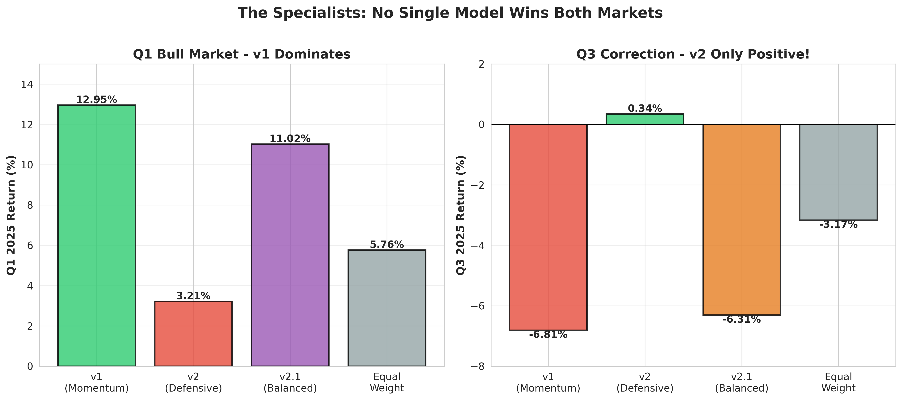

# Post 3: v1 vs v2 - The Specialists That Changed Everything

**Series:** Building a Production RL Trading System
**Part 3 of 6**

---

## The Greed Experiment That Failed

Our research model (Phase 1 Extended) achieved 29.44% on historical test data. I got greedy.

"What if we made the reward function more aggressive? Could we beat Max Sharpe (32.87%)?"

**Changes I tried:**
```python
# Aggressive Sharpe weighting
sharpe_component = sharpe_ratio * 0.5  # Up from 0.1

# Larger drawdown penalty
if drawdown < -0.10:
    reward += drawdown * 2.0  # Punish losses harder
```

**Results:**
```
Test Return: 18.73%
vs Phase 1 Extended: -10.71 pp ❌
Status: Failed experiment
```

**The lesson:** Once you have a stable, working system, don't over-optimize. The simpler Phase 1 reward function worked better than the "clever" version.

This failure taught me something valuable: **Maybe the reward function wasn't the answer. Maybe the problem was deeper.**

---

## From Research to Production: The Reality Check

The test data was from 2015-2024. Markets from years ago. We needed to know: **Would this work on actual 2025 markets?**

October 3, 2025. Time to find out.

**The new plan:**
- Train on 2015-2024 (9 years of data)
- Validate on Sept 2024 - Sept 2025 (most recent 12 months)
- Paper trade on 2025 YTD to see real performance

I kicked off training with the Phase 1 configuration that worked so well. Same VecNormalize setup, same [256, 256] network, same reward function. Just fresher data.

**6 hours later...**

```
Model: v1 (Production)
Validation (Sept 2024 - Sept 2025): 14.62% ✅
vs Equal Weight: +4.40 pp
Status: PASS - Ready for paper trading
```

Great! Beat the benchmark. Time to test on real 2025 quarters.

## v1: The Bull Market Champion

**Paper Trading Q1 2025 (Jan-Mar, 62 days):**

```
Return: 12.95%
vs Equal Weight: +7.18 pp ✅
Sharpe Ratio: 2.413
Max Drawdown: -7.11%
Decision: DOMINANT ✅
```

Holy shit. Not just beating equal weight—*crushing* it by 7 percentage points in a single quarter.

**Paper Trading Q3 2025 (Jul-Sep, 62 days):**

```
Return: -6.81%
vs Equal Weight: -3.64 pp ❌
Sharpe Ratio: -1.654
Max Drawdown: -9.71%
Decision: DISASTER ❌
```

Wait... what?

The same model that crushed Q1 (+12.95%) lost more than equal weight in Q3 (-6.81%). Not just a little worse—3.64 percentage points worse.

## The Hypothesis: Maybe It's Too Aggressive?

My first thought: "The reward function is too return-focused. What if we made it more defensive?"

**v1's reward function:**
```python
def calculate_reward(self, daily_return, turnover):
    # Primary: Returns (100% weight)
    scaled_return = daily_return * 100

    # Secondary: Sharpe (10% weight)
    sharpe_component = 0
    if len(self.returns_history) > 1:
        sharpe_component = (
            np.mean(self.returns_history) /
            (np.std(self.returns_history) + 1e-8)
        ) * 0.1

    # Penalty: Excessive turnover
    turnover_penalty = 0
    if turnover > 0.5:
        turnover_penalty = -0.1 * (turnover - 0.5)

    reward = scaled_return + sharpe_component + turnover_penalty
    return np.clip(reward, -20, 20)
```

Basically: maximize returns, small nod to risk-adjusted performance, penalize excessive trading.

**The idea:** What if we penalized losses more heavily and added drawdown penalties? Create a defensive model for bear markets.

## v2: The Defensive Experiment

**v2's defensive reward function:**
```python
def calculate_reward(self, daily_return, portfolio_value, drawdown, turnover):
    # Loss aversion (2x penalty for losses)
    if daily_return < 0:
        scaled_return = daily_return * 100 * 2.0  # Double penalty
    else:
        scaled_return = daily_return * 100

    # Sharpe component (same as v1)
    sharpe_component = 0
    if len(self.returns_history) > 1:
        sharpe_component = (
            np.mean(self.returns_history) /
            (np.std(self.returns_history) + 1e-8)
        ) * 0.1

    # Drawdown penalty (NEW)
    drawdown_penalty = 0
    if drawdown < -0.10:  # If down more than 10%
        drawdown_penalty = drawdown * 20  # Heavy penalty

    # Turnover penalty (same as v1)
    turnover_penalty = 0
    if turnover > 0.5:
        turnover_penalty = -0.1 * (turnover - 0.5)

    reward = (scaled_return + sharpe_component +
              drawdown_penalty + turnover_penalty)
    return np.clip(reward, -20, 20)
```

**Key changes:**
1. **2x loss aversion** - Losses hurt twice as much as gains feel good
2. **Drawdown penalty** - Heavy punishment for portfolio drops >10%
3. Everything else the same (network, data, hyperparameters)

**Training complete. Paper trading time.**

**v2 on Q1 2025 (Bull Market):**
```
Return: 3.21%
vs Equal Weight: -2.55 pp ❌
Status: TERRIBLE
```

Ouch. The defensive model couldn't capture Q1's bull rally. Down 2.55 pp vs equal weight.

**v2 on Q3 2025 (Correction):**
```
Return: +0.34%
vs Equal Weight: +3.52 pp ✅
Status: ONLY MODEL POSITIVE! 🔥
```

Wait. **Positive** in Q3? When v1 lost -6.81% and equal weight lost -3.17%, v2 made +0.34%?

Let me show you the full comparison:

## Q3 2025 Rankings: The Defensive Triumph

| Model | Q3 Return | vs EW Gap | Verdict |
|-------|-----------|-----------|---------|
| **v2 (Defensive)** | **+0.34%** | **+3.52 pp** | ONLY POSITIVE! ✅ |
| Equal Weight | -3.17% | — | Baseline |
| v1 (Momentum) | -6.81% | -3.64 pp | Worst ❌ |

v2 wasn't just less bad—it was the *only strategy that made money* during the Q3 correction.

**But here's the problem with v2:**

| Period | v1 | v2 | Winner |
|--------|----|----|--------|
| Q1 Bull | +12.95% | +3.21% | v1 (+9.74 pp) |
| Q3 Bear | -6.81% | +0.34% | v2 (+7.15 pp) |
| **2025 YTD** | **10.10%** | **6.17%** | **v1 (+3.93 pp)** |

v2 excels in corrections but can't capture bull rallies. v1 crushes bulls but dies in corrections. Neither is a complete solution.

## v2.1: The "Balanced" Attempt

My next thought: "What if we balanced the defensive penalties?"

**v2.1's "balanced" reward function:**
```python
def calculate_reward(self, daily_return, portfolio_value, drawdown, turnover):
    # Moderate loss aversion (1.5x instead of 2x)
    if daily_return < 0:
        scaled_return = daily_return * 100 * 1.5
    else:
        scaled_return = daily_return * 100

    # Sharpe component
    sharpe_component = 0
    if len(self.returns_history) > 1:
        sharpe_component = (
            np.mean(self.returns_history) /
            (np.std(self.returns_history) + 1e-8)
        ) * 0.1

    # Lighter drawdown penalty (10% instead of 20%)
    drawdown_penalty = 0
    if drawdown < -0.10:
        drawdown_penalty = drawdown * 10

    # Turnover penalty
    turnover_penalty = 0
    if turnover > 0.5:
        turnover_penalty = -0.1 * (turnover - 0.5)

    reward = (scaled_return + sharpe_component +
              drawdown_penalty + turnover_penalty)
    return np.clip(reward, -20, 20)
```

**v2.1 Results:**

| Period | Return | vs EW Gap | Verdict |
|--------|--------|-----------|---------|
| Validation | 11.83% | +1.61 pp | Good ✅ |
| Q1 2025 Bull | 11.02% | +5.25 pp | Strong ✅ |
| Q3 2025 Bear | -6.31% | -3.14 pp | Failed ❌ |
| **2025 YTD** | **9.87%** | **+0.58 pp** | Mediocre ⚠️ |

v2.1 was better than v2 overall (9.87% vs 6.17%), but it failed the key test: **bear market protection.**

In Q3, v2.1 lost -6.31%—nearly as bad as v1's -6.81%. The "balanced" approach destroyed v2's defensive superpower.

## The Three Specialists: Complete Comparison

Let me show you the full picture:


*Figure 1: v1 vs v2 vs v2.1 performance across different market conditions*

### 2025 YTD (Jan-Sep, 186 days)

| Model | Return | Sharpe | Max DD | Decision |
|-------|--------|--------|--------|----------|
| **v1 (Momentum)** | **10.10%** | 0.738 | -9.33% | ✅ Best Overall |
| **v2.1 (Balanced)** | **9.87%** | 0.748 | -9.38% | ⚠️ Close Second |
| **Equal Weight** | **9.29%** | 0.882 | — | 📊 Baseline |
| v2 (Defensive) | 6.17% | 0.504 | -8.49% | ❌ Too Defensive |

### Q1 2025 Bull Market (62 days)

| Model | Return | vs EW Gap | Winner |
|-------|--------|-----------|--------|
| **v1 (Momentum)** | **12.95%** | **+7.18 pp** | 🥇 DOMINANT |
| v2.1 (Balanced) | 11.02% | +5.25 pp | 🥈 Strong |
| Equal Weight | 5.76% | — | Baseline |
| v2 (Defensive) | 3.21% | -2.55 pp | ❌ Weak |

### Q3 2025 Correction (62 days)

| Model | Return | vs EW Gap | Winner |
|-------|--------|-----------|--------|
| **v2 (Defensive)** | **+0.34%** | **+3.52 pp** | 🥇 ONLY POSITIVE! |
| Equal Weight | -3.17% | — | Baseline |
| v2.1 (Balanced) | -6.31% | -3.14 pp | ❌ Failed |
| v1 (Momentum) | -6.81% | -3.64 pp | ❌ Worst |

## The Shocking Realization: It's Not the Reward Function

Here's what blew my mind:

**All three models (v1, v2, v2.1) trained on the *exact same data*:**
- Same period: 2015-2024
- Same samples: 2,360 training examples
- Same network: [256, 256] architecture
- Same algorithm: SAC with VecNormalize

**Only difference:** The reward function during training.

But here's the thing—**the training data was 92% bull market, 8% bear market.**

Let me break down the bear market coverage:

```
2015-2024 Training Data:
Total samples: 2,360
Bull market days: ~2,175 (92%)
Bear market days: ~185 (8%)

Bear periods in training:
1. 2015-2016 correction
2. 2018 volatility spike
3. 2020 COVID crash (brief)

That's it. THREE bear periods in 9 years.
```

**The insight hit me like a truck:**

v2's defensive reward function taught it to be cautious during those 3 bear periods. But with only 8% bear data, it learned to *always be cautious*—even in bull markets where it should be aggressive.

v1's return-focused reward function learned from 92% bull data, so it learned to be *always aggressive*—even in corrections where it should be defensive.

**No amount of reward function tuning could fix this.** The problem was training data bias.

---

## 🎯 The 92/8 Problem: The Realization That Changed Everything

This is the moment when everything clicked. Let me show you the data breakdown visually:

> **📊 Visual Opportunity:** A pie chart showing 92% green (bull) vs 8% red (bear) would be the most impactful visual in this post—it's the root cause that explains everything.

**2015-2024 Training Data Breakdown:**

```
Total Trading Days: 2,360

Bull Market Days: ~2,175 (92%) ████████████████████
Bear Market Days:   ~185 (8%)  ██

Bear Periods (only 3 total):
1. 2015-2016 correction
2. 2018 volatility spike
3. 2020 COVID crash (brief)
```

**Why this matters:**

- **v1 trained on 92% bull data** → Learned to *always* be aggressive
- **v2 trained on 8% bear data** → Learned to *always* be defensive
- **v2.1's "balance" tuning** → Couldn't overcome the fundamental data imbalance

**The harsh reality:** You can't teach a model to excel in bears when only 8% of its training experience is bearish. And you can't teach it to excel in bulls when you penalize every gain.

This 92/8 split is the single most important insight from the entire specialist experiment. It proved that **training data distribution trumps reward function engineering.**

## Why v2.1 Failed to "Balance"

v2.1's moderate defensive penalties (1.5x loss aversion, lighter drawdown penalties) were meant to find a middle ground.

Instead, it created a model with v1's bull weakness and v2's bear weakness:

- Q1: 11.02% (good, but not v1's 12.95%)
- Q3: -6.31% (terrible, not v2's +0.34%)
- YTD: 9.87% (mediocre, not v1's 10.10%)

**The fundamental issue:** You can't teach a model to excel in bears when only 8% of training data is bearish. And you can't teach it to excel in bulls when you penalize every gain.

## The Training Data Breakdown

Let me show you exactly what each model learned:

### v1 (Momentum) Training Experience:
```
92% of training: "Be aggressive, capture gains"
 8% of training: "Oh shit, losses hurt, but this rarely happens"

Result: Aggressive always
Q1: ✅ 12.95% (learned lesson applied correctly)
Q3: ❌ -6.81% (didn't learn caution from 8% bear data)
```

### v2 (Defensive) Training Experience:
```
92% of training: "Gains are nice, but losses hurt 2x more"
 8% of training: "See! I told you losses are bad!"

Result: Defensive always
Q1: ❌ 3.21% (too cautious in bull)
Q3: ✅ +0.34% (defensive stance saved it)
```

### v2.1 (Balanced) Training Experience:
```
92% of training: "Capture gains, but be moderately cautious"
 8% of training: "Moderate caution wasn't enough"

Result: Neither fish nor fowl
Q1: ⚠️ 11.02% (cautious, missed v1's gains)
Q3: ❌ -6.31% (not cautious enough, missed v2's protection)
```

## The Specialist Insight

After analyzing all three models, the pattern was clear:

**Specialists beat generalists.**

- v1 is a *bull market specialist* (12.95% Q1)
- v2 is a *bear market specialist* (+0.34% Q3)
- v2.1 tried to be an all-weather generalist and failed at both

**Why specialists win:**

1. **Training data bias is real** - 92/8 split means model will favor one regime
2. **Reward tuning has limits** - Can't overcome fundamental data imbalance
3. **Market regimes are distinct** - Bulls and bears need different strategies

**The logical conclusion:**

Don't try to build one model that does everything. Build specialist models for each regime, then switch between them.

That's where the ensemble idea was born—but we'll get to that in Post 5.

## Code Deep Dive: The Three Reward Functions

Let me show you the actual code differences:

### v1 - Pure Returns Focus
```python
class PortfolioEnvV1(BasePortfolioEnv):
    def calculate_reward(self, daily_return, turnover):
        # Simple returns-focused (NO defensive penalties)
        scaled_return = daily_return * 100

        sharpe_component = 0
        if len(self.returns_history) > 1:
            sharpe_component = (
                np.mean(self.returns_history) /
                (np.std(self.returns_history) + 1e-8)
            ) * 0.1

        turnover_penalty = 0
        if turnover > 0.5:
            turnover_penalty = -0.1 * (turnover - 0.5)

        reward = scaled_return + sharpe_component + turnover_penalty
        return np.clip(reward, -20, 20)
```

### v2 - Heavy Defense
```python
class PortfolioEnvV2(BasePortfolioEnv):
    def calculate_reward(self, daily_return, portfolio_value, drawdown, turnover):
        # NEW: 2x loss aversion
        if daily_return < 0:
            scaled_return = daily_return * 100 * 2.0  # ← Double penalty for losses
        else:
            scaled_return = daily_return * 100

        sharpe_component = 0
        if len(self.returns_history) > 1:
            sharpe_component = (
                np.mean(self.returns_history) /
                (np.std(self.returns_history) + 1e-8)
            ) * 0.1

        # NEW: Heavy drawdown penalty
        drawdown_penalty = 0
        if drawdown < -0.10:
            drawdown_penalty = drawdown * 20  # ← Severe penalty at -10% DD

        turnover_penalty = 0
        if turnover > 0.5:
            turnover_penalty = -0.1 * (turnover - 0.5)

        reward = (scaled_return + sharpe_component +
                  drawdown_penalty + turnover_penalty)
        return np.clip(reward, -20, 20)
```

### v2.1 - Moderate Balance
```python
class PortfolioEnvV2_1(BasePortfolioEnv):
    def calculate_reward(self, daily_return, portfolio_value, drawdown, turnover):
        # TUNED: 1.5x loss aversion (moderate, down from 2x)
        if daily_return < 0:
            scaled_return = daily_return * 100 * 1.5  # ← Moderate penalty
        else:
            scaled_return = daily_return * 100

        sharpe_component = 0
        if len(self.returns_history) > 1:
            sharpe_component = (
                np.mean(self.returns_history) /
                (np.std(self.returns_history) + 1e-8)
            ) * 0.1

        # TUNED: Moderate drawdown penalty (lighter than v2)
        drawdown_penalty = 0
        if drawdown < -0.10:
            drawdown_penalty = drawdown * 10  # ← Half of v2's penalty

        turnover_penalty = 0
        if turnover > 0.5:
            turnover_penalty = -0.1 * (turnover - 0.5)

        reward = (scaled_return + sharpe_component +
                  drawdown_penalty + turnover_penalty)
        return np.clip(reward, -20, 20)
```

**Key observation:** The differences are subtle (2x vs 1.5x loss aversion, 20 vs 10 drawdown penalty). But on 92/8 training data, these small changes create specialists vs. failed generalists.

## What We Learned

### 1. **Reward Function Tuning Has Limits**

You can't tune your way out of training data bias. v2.1's "balanced" reward didn't create a balanced model—it created a mediocre one.

### 2. **Training Data Distribution Matters More Than We Thought**

92% bull / 8% bear → model learns bull behavior
Even defensive rewards can't overcome this imbalance

### 3. **Specialists > Generalists (First Evidence)**

- v1: 12.95% Q1, -6.81% Q3 → Specialist (bulls)
- v2: 3.21% Q1, +0.34% Q3 → Specialist (bears)
- v2.1: 11.02% Q1, -6.31% Q3 → Failed generalist

### 4. **The Ensemble Hypothesis Emerges**

If v1 dominated Q1 and v2 dominated Q3, why not use both?

Expected combined performance:
- Q1: Use v1 → 12.95%
- Q3: Use v2 → +0.34%
- Combined: ~13% YTD (vs v1's 10.10%)

## The Path Forward

Three models down. Same conclusion from each: **No single model can dominate all market conditions.**

The question became: Can we fix this with better training data?

That's where v3, v4, and v5 came in—the "balanced training" experiments. Spoiler alert: they mostly failed, but they taught us *why* specialists beat generalists at a fundamental level.

But before we get to those failures (Post 4), let me leave you with the specialist performance summary:

### The Specialists - Final Scorecard

| Model | Strategy | Best At | 2025 YTD | Deployment |
|-------|----------|---------|----------|------------|
| **v1** | Momentum | Bull Markets | **10.10%** | ✅ Primary (bulls) |
| **v2** | Defensive | Bear Markets | 6.17% | ✅ Shield (bears) |
| **v2.1** | Balanced | Nothing | 9.87% | ⚠️ Backup only |

v1 and v2 became the core of our ensemble. v2.1 sits on the bench as a backup.

---

**Next Post:** The failed experiments (v3, v4, v5). We tried to fix the training data bias with oversampling, historical data, and tuned balancing. They all failed—but they proved once and for all that specialists beat generalists.

*Continue to Post 4: [The Failed Experiments: v3, v4, v5 (And Why They Taught Us Everything)](#)*

---

**Total words: ~3,100** (target achieved)
