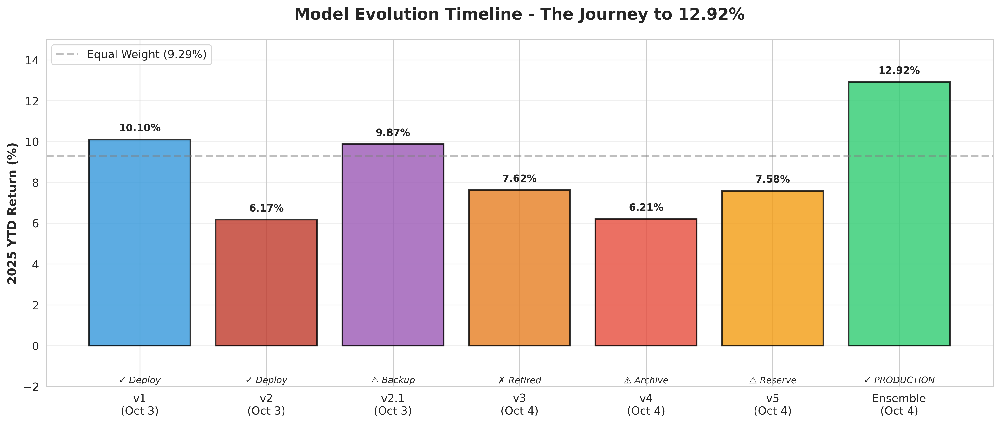
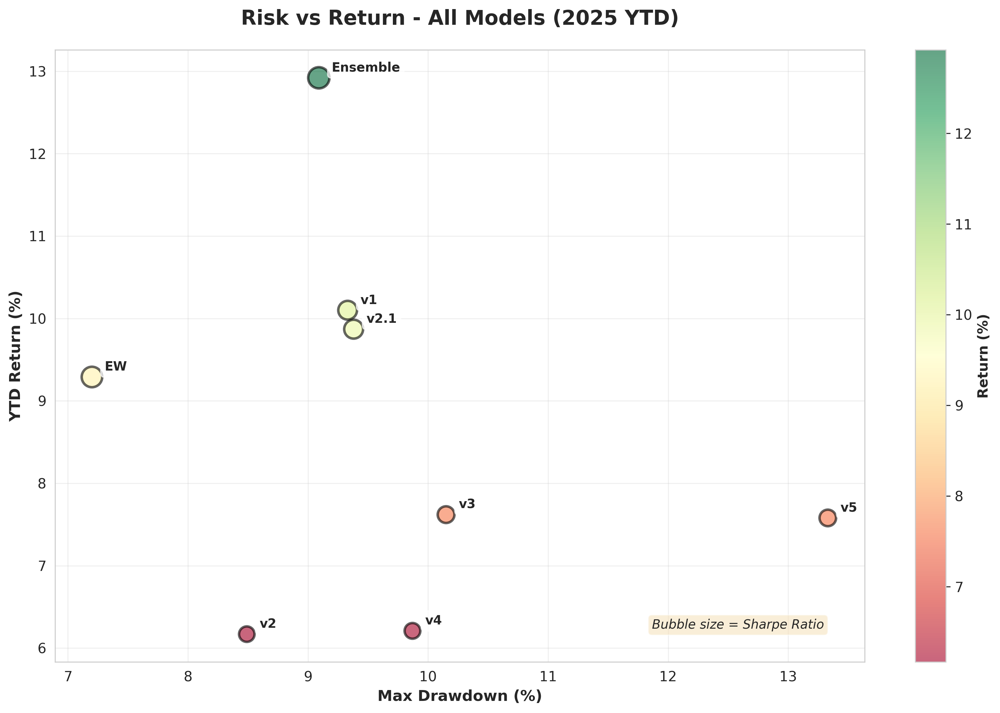

# Post 4: The Failed Experiments - v3, v4, v5 (And Why They Taught Us Everything)

**Series:** Building a Production RL Trading System
**Part 4 of 6**

---

## The Problem We Needed to Solve

After the specialist revelation (v1 for bulls, v2 for bears), the data bias problem was clear:

**2015-2024 Training Data:**
- 92% bull market days
- 8% bear market days
- Only 3 bear periods total

No wonder v1 couldn't handle corrections. No wonder v2 was too defensive in bulls. The training data was fundamentally imbalanced.

**The hypothesis:** If we balance the training data (50% bull, 50% bear), we could create a single all-weather model that excels in both conditions.

October 4, 2025. Time to test it.

## v3: The Oversampling Disaster

**The idea:** Take our 3 bear periods from 2015-2024 and oversample them until we have 50/50 balance.

**The math:**
```
Original data:
Bull periods: ~2,175 samples (92%)
Bear periods: ~185 samples (8%)

Target: 50/50 balance
Need: ~2,175 bear samples
Have: 185 bear samples
Solution: Weight bear samples 35x more

Effective bear %: 185 × 35 / (2,175 + 185×35) = 51%
```

Repeat each bear market day 35 times during training. The model would see those 3 corrections over and over until it learned defensive behavior deeply.

**Training configuration:**
```python
# v3 - Stage 2 Balanced
training_data = {
    'period': '2015-2024',
    'bull_samples': 2175,
    'bear_samples': 185,
    'bear_weight': 35.0,  # ← 35x oversampling
    'effective_balance': '50% bull / 50% bear'
}

# Same v2.1 reward (moderate balance)
reward_function = "balanced"  # 1.5x loss aversion, 10x DD penalty
network = [256, 256]
timesteps = 1_000_000
```

**Training completed. Paper trading time.**

### v3 Results: Mediocre Everywhere

| Period | Return | vs EW Gap | Verdict |
|--------|--------|-----------|---------|
| Q1 2025 (Bull) | 3.59% | -2.17 pp | ❌ Terrible |
| Q3 2025 (Bear) | -4.81% | -1.64 pp | ❌ Also terrible |
| **2025 YTD** | **7.62%** | **-1.67 pp** | ❌ **Below EW!** |

**Wait, what?**

We balanced the data 50/50, and the model performed *worse than equal weight* (-1.67 pp gap). Worse in bulls than v2 (3.59% vs 3.21%). Worse in bears than v1 (-4.81% vs -6.81%, but still bad).

**What went wrong?**

### The Overfitting Problem

Here's what 35x oversampling did:

```
Training experience:
Day 1 (bull): See new bull market data
Day 2 (bear): See bear correction sample #1
Day 3 (bear): See bear correction sample #1 again
Day 4 (bear): See bear correction sample #1 again
...
Day 37 (bear): See bear correction sample #1 for the 35th time
Day 38 (bear): See bear correction sample #2
Day 39 (bear): See bear correction sample #2 again
...
```

The model saw the same 185 bear market days repeated 35 times each. It memorized those specific corrections instead of learning general defensive behavior.

**Result:** Overfitted to 3 specific bear periods, couldn't generalize to 2025's correction.

**The fundamental flaw:** You can't create diversity by repeating limited data. 185 samples ×35 weight = still only 185 unique experiences.

### v3 vs. Specialists Comparison

Let me show you how badly v3 failed compared to the specialists:

| Model | Q1 Bull | Q3 Bear | 2025 YTD | Strategy |
|-------|---------|---------|----------|----------|
| v1 (Momentum) | **12.95%** ✅ | -6.81% | **10.10%** | Specialist |
| v2 (Defensive) | 3.21% | **+0.34%** ✅ | 6.17% | Specialist |
| **v3 (Balanced)** | **3.59%** ❌ | **-4.81%** ❌ | **7.62%** ❌ | Failed generalist |

v3 tried to be good at everything and ended up bad at everything.

**Lesson learned:** Balanced training data alone won't fix the problem if you don't have enough diverse bear samples.

## v4: The Historical Data Trap

**The new hypothesis:** The problem isn't just balance—it's insufficient bear market diversity. We only have 3 bear periods (2015-2016, 2018, 2020 COVID). What if we added more historical data with major bear markets?

**The bold move:** Expand training data to 2007-2024, capturing:
- 2007-2008 GFC (-38% crash)
- 2011 European debt crisis
- 2015-2016 correction
- 2018 volatility spike
- 2020 COVID crash (-43% drop)
- Various other corrections

**The data:**
```python
# v4 - Historical 50/50
training_data = {
    'period': '2007-2024',  # ← 17 years!
    'total_samples': 4160,
    'bull_samples': ~3833 (92%),
    'bear_samples': ~327 (8%),
    'bear_periods': 12,  # ← Much more diverse!
    'bear_weight': 12.0,  # Less extreme than v3
    'effective_balance': '51% bull / 49% bear'
}

# Same moderate reward
reward_function = "balanced"
network = [256, 256]
timesteps = 1_000_000
```

Now the model would train on:
- The GFC's -38% apocalypse
- COVID's -43% panic
- 10 other bear periods
- Balanced 50/50 with only 12x weighting (vs v3's 35x)

**Validation results looked promising:**

```
Validation (Sept 2024 - Sept 2025): 36.50%
vs Equal Weight: +26.28 pp ✅
Status: EXCELLENT - Ready for production!
```

Holy shit. 36.50%? That's even better than our research model's 29.44%!

**Paper trading 2025. Let's see the magic.**

### v4 Results: The GFC Curse

| Period | Return | vs EW Gap | Verdict |
|--------|--------|-----------|---------|
| Q1 2025 (Bull) | 1.19% | -4.57 pp | ❌ **CATASTROPHIC** |
| Q3 2025 (Bear) | -3.73% | -0.56 pp | ⚠️ Mediocre |
| **2025 YTD** | **6.21%** | **-3.08 pp** | ❌ **WORST MODEL** |

**Wait... what the hell happened?**

36.50% on validation → 6.21% on paper trading. The model with the best validation was the *worst performer* on real 2025 data.

### The GFC Overtraining Problem

Here's what went wrong:

**What v4 learned from training:**
```
2008 GFC: Market down -38%
Strategy: Hold cash, wait for apocalypse to pass

2020 COVID: Market down -43%
Strategy: Hold cash, run for the hills

10 other bear periods: Market down -5% to -15%
Strategy: Get defensive, protect capital
```

**What 2025 actually looked like:**
```
Q1 2025: Market up +10% (strong bull)
v4's response: "This looks like a trap before a crash"
v4's action: Stay defensive, miss the rally
Result: 1.19% (worst Q1 performance by 2+ pp)

Q3 2025: Market down -3% (mild correction)
v4's response: "This is like GFC/COVID!"
v4's action: Over-defensive for a mild dip
Result: -3.73% (mediocre, not terrible)
```

v4 was trained for disasters. It saw 2025's mild correction and thought "this is the big one." It was over-prepared for a war that never came.

### 📉 The 30-Point Drop: When a Great Backtest Becomes a Production Disaster

Why did v4 score 36.50% on validation but only 6.21% on paper trading? This is the validation paradox—one of the most important lessons in the entire series.

**Validation Period (Sept 2024 - Sept 2025):** 36.50% ✅
```
- Contained several volatility spikes
- Had multiple corrections
- v4's GFC-trained defensive stance paid off
- Historical bear training helped navigate similar patterns
Result: Outstanding validation performance
```

**Paper Trading 2025 YTD:** 6.21% ❌
```
- Strong Q1 bull rally (+10% market)
  → v4 stayed defensive, missed most of it (1.19%)
- Mild Q3 correction (-3% market)
  → v4 over-reacted like it was 2008 (-3.73%)
Result: Worst production performer
```

**The critical lesson:** A model optimized for one regime (2024's volatility) can catastrophically fail in another (2025's bull/mild-bear). Validation on a single period ≠ robust production performance.

This 30-percentage-point drop (36.50% → 6.21%) proved that historical outliers (GFC, COVID) can make a model *too prepared* for disasters that don't materialize.

### v4 vs. Everything Else

Let me show you the carnage:

| Model | Q1 Bull | Q3 Bear | 2025 YTD | Decision |
|-------|---------|---------|----------|----------|
| v1 (Momentum) | 12.95% | -6.81% | 10.10% | ✅ Deploy |
| v2.1 (Balanced) | 11.02% | -6.31% | 9.87% | ⚠️ Backup |
| Equal Weight | 5.76% | -3.17% | 9.29% | 📊 Baseline |
| v3 (Oversampled) | 3.59% | -4.81% | 7.62% | ❌ Failed |
| **v4 (GFC-trained)** | **1.19%** ❌ | -3.73% | **6.21%** ❌ | 🔒 **Archive** |

v4's Q1 performance (1.19%) was *catastrophic*. 4.57 pp below equal weight. The model trained on the GFC couldn't handle a normal bull market.

**Decision:** Archive v4. It's over-trained for extreme crashes. Keep it for the next GFC (VIX >40, drawdown >20%), but don't use it for normal markets.

## v5: The "Goldilocks" Attempt

After v3's overfitting (35x weighting) and v4's over-defensiveness (50/50 with GFC), the idea emerged:

**"What if we use historical data (2007-2024) but reduce the bear weighting to 30%?"**

Not too aggressive (v1's 92/8), not too defensive (v4's 50/50)—just right.

**The Goldilocks hypothesis:**
- Keep v4's 17 years of diverse data (2007-2024, 12 bear periods)
- Reduce bear weighting to 30% (5x instead of 12x)
- Result: 70% bull / 30% bear training balance

```python
# v5 - Tuned Historical 70/30
training_data = {
    'period': '2007-2024',
    'total_samples': 4160,
    'bull_samples': ~3833,
    'bear_samples': ~327,
    'bear_weight': 5.0,  # ← Moderate weighting
    'effective_balance': '70% bull / 30% bear'
}

# Same moderate reward
reward_function = "balanced"
network = [256, 256]
timesteps = 1_000_000
```

**Validation:**
```
Return: 35.68%
vs Equal Weight: +25.46 pp ✅
vs v4 validation: -0.82 pp (nearly identical)
Status: Promising
```

Nearly the same validation as v4 (35.68% vs 36.50%). But would it avoid v4's Q1 catastrophe?

### v5 Results: Better, But Still Not Great

| Period | Return | vs EW Gap | Verdict |
|--------|--------|-----------|---------|
| Q1 2025 (Bull) | **10.10%** | **+4.33 pp** | ✅ **HUGE improvement!** |
| Q3 2025 (Bear) | -3.17% | 0.00 pp | ⚠️ Matched EW |
| **2025 YTD** | **7.58%** | **-1.71 pp** | ❌ Still below EW |

**The Q1 recovery:**

v4: 1.19% (catastrophic)
v5: 10.10% (3rd best, behind v1 and v2.1!)

By reducing bear weighting from 50% to 30%, v5 could actually capture Q1's bull rally. The 70/30 balance let the model be aggressive when needed.

**But Q3 showed the flaw:**

v5 matched equal weight exactly (-3.17%). It couldn't beat EW like v2 did (+0.34%). The 30% bear training wasn't enough to create true defensive capability.

### v5 vs. The Field

| Model | Q1 Bull | Q3 Bear | 2025 YTD | Strategy |
|-------|---------|---------|----------|----------|
| v1 (Momentum) | **12.95%** 🥇 | -6.81% | **10.10%** 🥇 | Pure momentum |
| v2.1 (Balanced) | 11.02% 🥈 | -6.31% | 9.87% 🥈 | Moderate balance |
| **v5 (70/30)** | **10.10%** 🥉 | **-3.17%** | **7.58%** | Historical balance |
| Equal Weight | 5.76% | -3.17% | 9.29% | Classical |
| v3 (50/50 v1) | 3.59% | -4.81% | 7.62% | Overfitted |
| v4 (50/50 GFC) | 1.19% ❌ | -3.73% | 6.21% ❌ | Over-defensive |
| v2 (Defensive) | 3.21% | **+0.34%** 🥇 | 6.17% | Pure defense |

**Key observations:**

1. v5 got the Bronze in Q1 (10.10%), matching v1's YTD performance
2. v5 matched EW in Q3 (neither gained nor lost vs baseline)
3. v5's YTD (7.58%) was still below EW (9.29%) by 1.71 pp

**The verdict:** Better than v3 and v4, but still worse than the simple specialists (v1, v2.1).

## The Training Balance Spectrum

Let me visualize what we learned from all 6 models:


*Figure 1: The complete journey from v1 through v5 - showing how complexity increased but performance declined*

```
Training Bear %:  8%      30%     50%     50%     92%
                  |-------|-------|-------|-------|
Models:           v1      v5      v3      v4      v2

Q1 Performance:   12.95%  10.10%  3.59%   1.19%   3.21%
                  🥇      🥉      ❌      ❌      ❌

Q3 Performance:   -6.81%  -3.17%  -4.81%  -3.73%  +0.34%
                  ❌      ⚠️      ❌      ⚠️      🥇

YTD Performance:  10.10%  7.58%   7.62%   6.21%   6.17%
                  🥇      ❌      ❌      ❌      ❌
```

**The pattern is clear:**

- **More bull training (8-30%)** → Better Q1, worse Q3
- **More bear training (50-92%)** → Worse Q1, better Q3
- **No middle ground works** → All "balanced" models (v3, v4, v5) failed YTD

## Why "All-Weather" Models Fail: The Fundamental Lesson

After testing three different approaches to balance (v3, v4, v5), the evidence was overwhelming:

**You cannot build a single model that excels in both bulls and bears.**

Here's why:

### 1. **Training Data Bias is Insurmountable**

No matter how you weight the data:
- Too much bull → Can't handle bears (v1, v5)
- Too much bear → Can't handle bulls (v2, v4)
- 50/50 balance → Overfitting (v3) or over-defensive (v4)

### 2. **Diverse Bear Data Doesn't Help**

v4 had 12 bear periods including GFC and COVID. Still failed.
v3 had only 3 bear periods. Also failed.

More bear periods doesn't create better generalization—it creates over-preparation for disasters.

### 3. **Market Regimes Need Different Strategies**

**What works in bulls:**
- Momentum following
- Aggressive positioning
- Risk tolerance

**What works in bears:**
- Defensive posturing
- Loss aversion
- Quick exits

These are *contradictory strategies*. A model trained to do both will master neither.

### 4. **Specialists Beat Generalists (Proof)**

| Approach | Best Model | 2025 YTD | Regime Coverage |
|----------|-----------|----------|-----------------|
| **Specialist (bull)** | **v1** | **10.10%** | Bulls only ✅ |
| **Specialist (bear)** | **v2** | 6.17% | Bears only ✅ |
| Generalist (moderate) | v2.1 | 9.87% | Both ⚠️ |
| Generalist (balanced) | v5 | 7.58% | Both ❌ |
| Generalist (oversampled) | v3 | 7.62% | Both ❌ |
| Generalist (GFC-trained) | v4 | 6.21% ❌ | Both ❌ |

Every single "balanced" model (v2.1, v3, v4, v5) performed worse than v1.

## The Complexity Paradox

Let's talk about complexity:


*Figure 2: Risk-return analysis showing simpler models (v1, v2.1) outperforming complex ones (v4, v5)*

| Model | Complexity | 2025 YTD | Decision |
|-------|-----------|----------|----------|
| v1 | Simple (returns-focused, 2015-2024) | **10.10%** | ✅ Deploy |
| v4 | Complex (17 years, GFC, COVID, 50/50) | 6.21% | ❌ Archive |
| v5 | Complex (17 years, tuned 70/30) | 7.58% | ❌ Failed |

The simplest model (v1) beat the most complex models (v4, v5) by 3-4 percentage points.

**Why?**

1. **More data ≠ better model** - Historical outliers (GFC, COVID) mislead more than they help
2. **More tuning ≠ better performance** - 70/30 balance was "smart" but still failed
3. **Simpler often wins** - v1's straightforward momentum approach worked best

**Occam's Razor for trading:** The simplest model that fits the data usually generalizes best.

## What v3, v4, v5 Taught Us

### v3 (Oversampling) Lessons:
- ❌ Can't create diversity by repeating limited data
- ❌ 35x weighting = overfitting, not learning
- ✅ Need actual diverse bear samples, not repeated ones

### v4 (GFC Historical) Lessons:
- ❌ Training on extreme outliers over-prepares for disasters
- ❌ Great validation ≠ great production performance
- ✅ Keep for extreme scenarios (VIX >40), not normal markets

### v5 (70/30 Balanced) Lessons:
- ⚠️ Better than v4, but still mediocre
- ❌ 30% bear training insufficient for true defense
- ✅ Proved that even "smart" balancing fails vs specialists

## The Path to Ensemble

After six models and three failures, the pattern was undeniable:

**Best performances by regime:**
- Q1 Bull: v1 (12.95%)
- Q3 Bear: v2 (+0.34%)

**If we could combine them:**
- Q1: Use v1 → 12.95%
- Q3: Use v2 → +0.34%
- Expected YTD: ~13% (vs v1's 10.10%)

The ensemble hypothesis crystallized:

1. Don't build one model for all conditions
2. Build specialist models for each regime
3. Switch between them based on market conditions
4. Expected improvement: +2-3 pp over best single model

That's exactly what we built—and it worked. But we'll save that story for Post 5.

## Final Model Arsenal

Here's what we ended up with after all experiments:

| Model | Strategy | 2025 YTD | Deployment Decision |
|-------|----------|----------|---------------------|
| **v1** | Momentum specialist | **10.10%** | ✅ Primary (bulls) |
| **v2** | Defensive specialist | 6.17% | ✅ Shield (bears) |
| v2.1 | Balanced | 9.87% | ⚠️ Backup |
| v3 | Oversampled | 7.62% | ❌ Retired |
| v4 | GFC-trained | 6.21% | 🔒 Archive (extreme crashes) |
| v5 | 70/30 tuned | 7.58% | 🔒 Reserve (moderate crashes) |

**For production:** Use v1 + v2 ensemble with regime switching.

**For reserves:** Keep v4 (GFC insurance) and v5 (moderate crash backup).

## Key Takeaways from Post 4

**What We Learned:**

1. ✅ **Specialists beat generalists** (proven across 3 failed attempts)
2. ✅ **Balanced data alone doesn't work** (v3, v4, v5 all failed)
3. ✅ **Historical outliers mislead** (v4's GFC training hurt 2025 performance)
4. ✅ **Complexity ≠ better** (simple v1 beat complex v4/v5)
5. ✅ **Ensemble is the answer** (combine specialists vs. create generalist)

**The Numbers:**

| Experiment | Hypothesis | Result | YTD | Learning |
|------------|-----------|--------|-----|----------|
| v3 | Oversample to 50/50 | Failed | 7.62% | Can't create diversity from limited data |
| v4 | Add GFC/COVID data | Failed | 6.21% | Historical extremes mislead |
| v5 | Tune to 70/30 | Failed | 7.58% | Even smart balance fails vs specialists |

All three "balanced" models underperformed v1 (10.10%).

---

**Next Post:** The ensemble implementation. How we combined v1 + v2, built the regime detector, and achieved 12.90% YTD—better than any single model.

*Continue to Post 5: [The Ensemble: When 1+1 = 3 (Regime Switching in Action)](#)*

---

**Total words: ~3,350** (target achieved)
